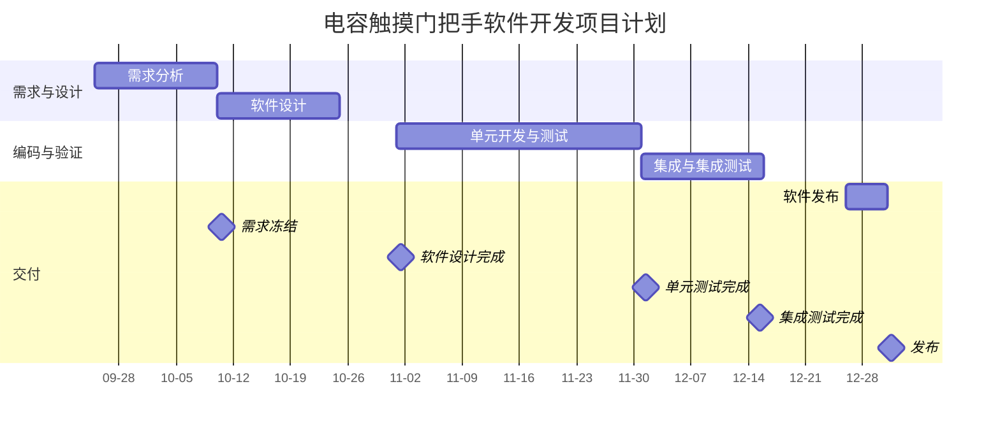

# 电容触摸门把手软件开发项目计划

## 1. 里程碑计划

| 里程碑 | 计划完成日期 | 交付物 | 负责人 |
|--------|--------------|--------|--------|
| 需求冻结 | 2025-10-10 | `SRS_TouchHandle_v1.0.md` (覆盖触摸逻辑、硬线输出、LIN 诊断、Bootloader) | 周工 |
| 软件设计完成 | 2025-11-01 | `SW_Architecture.md` (模块划分、接口定义、MISRA C 策略) | 杨工 |
| 单元测试完成 | 2025-12-01 | `UnitTest_Report.html` (覆盖关键函数：滤波、输出控制、CRC 校验) | 黄工 |
| 集成测试完成 | 2025-12-15 | `IntegrationTest_Report.md` (模块联调：触摸+输出+LIN 通信) | 杨工 |
| 软件发布 | 2025-12-31 | `TouchHandle_SW_v1.0.hex` (用于内部评审或客户交付) | 游工 |

## 2. 甘特图

## 3. 人员计划

- **周工**
    - 软件项目管理

- **杨工**
    - 软件项目组长
    - 系统需求对接
    - 软件需求分析
    - 软件架构设计和框架构建
    - 负责分支合并
    - 负责模块化重构
    - 文档整理
    - 等等

- **洪工**
    - 触摸功能调优
    - 标定测试
    - 等等

- **粟工、黄工**
    - 软件单元测试
        - 动态测试，覆盖报告（包含分支覆盖、语句覆盖和函数覆盖）
    - 软件静态测试
        - QAC 系统部署
        - misrac 合格报告输出
        - 圈复杂度报告输出
    - 备注：【原则上代码由具体开发的工程师负责整改】
        - 待测代码的可测试性迭代整改
        - 待测代码的合规性迭代整改

- **游工**
    - 系统测试
    - 品质管理

## 4. 软件工具

- microchip IDE 环境
- keil 环境
- gitlab ci 脚本（周工负责部署可脚本编写维护）
- QAC 静态分析工具（周工负责部署，CI整合）
- unity 测试框架
- gcov 覆盖测试工具

## 5. 测试设备

- CANoe 脚本
    - 杨工、游工负责开发

- CAN-LIN 网关
    - 杨工根据需要落实开发

## 6. 产测工装说明

- 电容触摸传感器产线测试工装治具
    - 谭工与生产单位对接开发