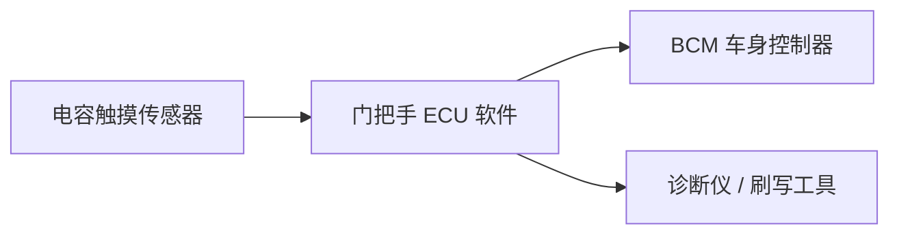

# 软件需求规格书（SRS）  
**项目**：电容触摸汽车门把手开关  
**版本**：v1.0  
**日期**：2025-11-27  
**作者**：[你的姓名 / 软件团队]  
**目标 ASPICE 等级**：CL1.5（SWE.1）

---

## 1. 引言

### 1.1 目的
定义电容触摸门把手软件的功能、性能、安全及诊断需求，作为设计、编码和测试的依据。

### 1.2 范围
- 输入：电容触摸传感器信号、LIN 总线通信  
- 输出：硬线开关信号（控制门锁）、LIN 诊断响应  
- 不包括：机械结构、电源管理、BCM（车身控制器）逻辑

### 1.3 术语
| 术语 | 说明 |
|------|------|
| ECU | 本门把手控制单元 |
| BCM | 车身控制器（接收硬线开关信号） |
| DID | Data Identifier，UDS 数据标识符 |
| LIN | Local Interconnect Network，用于诊断与刷写 |

---

## 2. 总体描述

### 2.1 系统架构
```text
[触摸传感器] → [ECU 软件] → [硬线输出] → BCM
                     ↓
                [LIN 接口] ↔ 诊断仪/刷写工具
```



### 2.2 运行模式
- **Normal Mode**：检测触摸，控制输出  
- **Diagnostic Mode**：响应 UDS 服务（由 LIN 唤醒）  
- **Bootloader Mode**：接收固件升级（通过 UDS 0x34/36/37）

---

## 3. 软件需求

> ✅ 所有需求均编号，格式：`SWE_REQ_XXX`，便于追溯

### 3.1 功能需求（Functional Requirements）

| ID | 需求描述 | 验证方式 |
|----|--------|--------|
| **SWE_REQ_001** | 当电容传感器检测到有效触摸（持续时间 ≥200ms 且信号强度 ≥阈值），ECU 应将硬线开关信号置为 **LOW（≤0.5V）**，持续 1.0s ±10% | SWE.6 合格性测试（示波器测量） |
| **SWE_REQ_002** | 触摸释放后，硬线信号应在 50ms 内恢复为 **HIGH（≥4.5V）** | SWE.6 测试 |
| **SWE_REQ_003** | 支持 UDS 服务 **0x22（Read Data By Identifier）**，读取以下 DID：<br> - `0xF190`：软件版本（3 字节）<br> - `0xF189`：硬件版本（2 字节） | SWE.5 集成测试（CANoe 仿真） |
| **SWE_REQ_004** | 支持 UDS 服务 **0x2E（Write Data By Identifier）**，写入 DID `0xDE00` 用于配置触摸灵敏度（1 字节，范围 0x01~0x05） | SWE.5 测试 |
| **SWE_REQ_005** | 支持 UDS **0x34/0x36/0x37** 实现 LIN 固件刷写：<br> - 使用 CRC32 校验固件完整性<br> - 刷写失败时回滚至原固件 | Bootloader 单独测试 |
| **SWE_REQ_006** | 若连续 3 次 LIN 通信超时（>50ms），ECU 应：<br> - 关闭硬线输出（安全状态）<br> - 存储 DTC **U0155**（Lost Communication with LIN Master） | 故障注入测试 |

---

### 3.2 非功能需求（Non-Functional Requirements）

| ID | 类别 | 需求描述 | 验证方式 |
|----|------|--------|--------|
| **SWE_REQ_101** | **性能** | 触摸检测到硬线输出延迟 ≤100ms | 示波器测量 |
| **SWE_REQ_102** | **资源** | 软件 RAM 占用 ≤2KB，ROM ≤16KB | 链接器映射文件分析 |
| **SWE_REQ_103** | **可靠性** | 在 -40°C ~ +85°C 环境下，触摸误触发率 ≤0.1% | 环境舱测试 |
| **SWE_REQ_104** | **安全性** | 硬线输出故障时（如驱动短路），不得导致门锁意外开启 | FMEA 分析 + 故障测试 |
| **SWE_REQ_105** | **可维护性** | 所有 C 代码符合 **MISRA C:2012** 规则（使用 Helix-QAC 2023.3 检查） | 静态分析报告 |
| **SWE_REQ_106** | **诊断** | DTC U0155 可通过 0x19 服务读取，并支持 0x85 临时禁用 | UDS 测试 |

---

## 4. 需求追溯与验证计划

| 需求ID | 设计模块 | 单元测试 | 集成测试 | 合格性测试 |
|--------|--------|--------|--------|----------|
| SWE_REQ_001 | `output_ctrl.c` | UT_001 | IT_001 | QT_001 |
| SWE_REQ_003 | `uds_server.c` | — | IT_002 | QT_002 |
| SWE_REQ_005 | `bootloader.c` | — | IT_003 | QT_003 |
| SWE_REQ_105 | 全局 | QAC_Report | — | — |

> ✅ 此表满足 **PA2.2（追溯性）** 的 L– 要求。

---

## 5. 修订历史（满足 PA2.2 变更控制）

| 版本 | 日期 | 修改人 | 修改内容 | 原因 |
|------|------|--------|--------|------|
| v1.0 | 2025-11-27 | 张工 | 初稿 | 项目启动 |

---

## 6. 附录：接口说明

### 6.1 硬件接口
- **硬线输出**：GPIO3，开漏输出，外接上拉至 5V
- **LIN 接口**：LIN2.2，波特率 19200 bps，主节点地址 0x01

### 6.2 软件接口
- `bool is_valid_touch(void)` ← 由 `touch_sensor.c` 提供  
- `void set_switch_output(bool state)` ← 由 `output_ctrl.c` 实现
