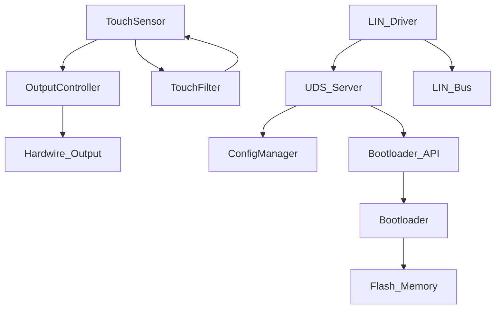

##  软件模块架构图

---

## 🔍 模块说明（与代码文件对应）

| 模块 | 源文件 | 职责 | ASPICE 过程 |
|------|--------|------|------------|
| **TouchSensor Driver** | `touch_sensor.c` | 采集传感器原始数据，调用滤波器，判断有效触摸 | SWE.2, SWE.3 |
| **Touch Filter** | 内联或 `filter.c` | 滑动平均、自适应阈值、防抖（满足 SWE_REQ_103） | SWE.3 |
| **Output Controller** | `output_ctrl.c` | 控制 GPIO 输出硬线信号（满足 SWE_REQ_001/002） | SWE.3 |
| **LIN Driver** | `lin_driver.c` | 底层 LIN 帧收发（基于 UART + 定时器） | SWE.2 |
| **UDS Server** | `uds_server.c` | 解析 UDS 服务（0x22/0x2E/0x34/36/37），响应 DID | SWE.2 |
| **Configuration Manager** | `config_mgr.c` | 管理可配置参数（如触摸灵敏度 SWE_REQ_004） | SWE.3 |
| **Bootloader API** | `bootloader_if.c` | 提供刷写接口，调用 Bootloader 分区 | SWE.2 |
| **Bootloader** | 独立链接分区 | 接收固件、校验 CRC32、管理双Bank（满足 SWE_REQ_005） | SWE.6（单独验证） |
