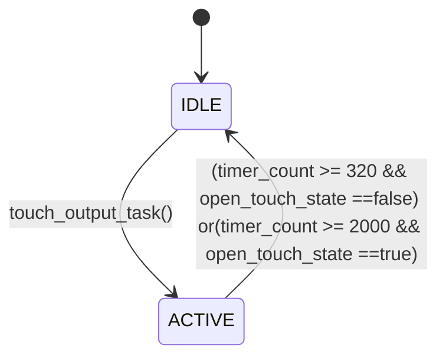
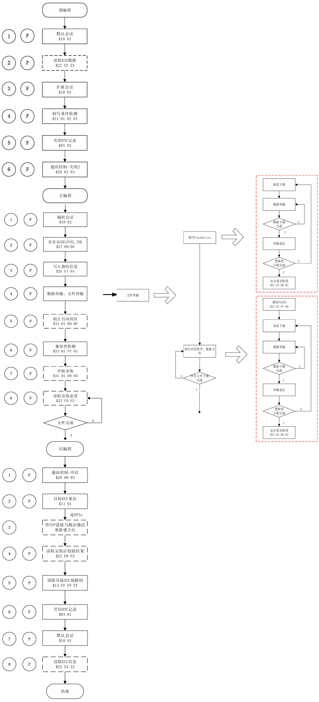

# 门把手触摸功能软件详细设计文档 (SDD)
**（基于 SRS V1.5 — 电容信号由厂商 SDK 提供）**

**文档 ID:** SDD-DOORHANDLE-TOUCH-V1.0
**标题:** 门把手触摸功能软件详细设计
**版本历史:**
| 版本 | 日期       | 作者 | 变更说明 |
|------|------------|------|----------|
| V1.0 | 2025-11-11 | 洪工 | 初稿，基于 SRS V1.5 编写 |
| V2.0 | 2025-12-1 | 杨 | 根据ots1阶段代码实现功能进行补充 |

---

## 1. 引言

### 1.1 目的
本文档描述门把手触摸功能的**软件详细设计**，包括模块划分、接口定义、状态机、关键算法及数据结构，用于指导编码、单元测试与集成。

### 1.2 范围
- 覆盖所有软件模块：`touch_detection_task`、`touch_signal_input_task`、`low_power_task`、`lin_task`、`release_uds_queue_task、mcu_reset_task`、feed_wdt_task、jump_to_app_task(仅boot使用)；
- 不包含厂商 SDK 内部实现（视为黑盒）；
- 不涉及硬件电路设计。

### 1.3 参考文档
- 《门把手触摸功能软件需求分析说明书》V1.5 (SRS-DOORHANDLE-TOUCH-V1.5)；
- 电容传感芯片厂商 SDK 用户手册（示例：CAP1298 SDK v2.1）；
- LIN 2.1A 协议规范、ISO 14229规范；
- 项目编码规范 V1.0。

---

## 2. 系统架构概述

### 2.1 软件架构图（文字描述）
系统采用**分层模块化设计**，主应用协调以下模块：
- **touch_detection_task**：封装厂商电容 SDK；
- **touch_signal_input_task**：管理开锁信号输出；
- **low_power_task**：监测mcu是否需要进入低功耗；
- **lin_task**：处理 LIN 数据接收；
- **release_uds_queue_task**：超时释放uds未发送完的数据。

主循环运行于低优先级任务，中断处理触摸与 LIN 事件。

### 2.2 任务与中断
| 任务/中断        | 描述 |
|------------------|------|
| `Main_Task`      | 主循环，轮询触摸事件，更新系统状态，隔离sdk |
| `CAP_INT_Handler`| gpio 中断，标记触摸事件到来 |
| `SERCOM_RX_Handler` | lin 接收中断，接收总线上的字节数据 |
| `EIC_User_Handler` | gpio外部中断，进入低功耗前设置lin rx为gpio，当总线上有lin数据时，通过外部中断唤醒退出低功耗 |
| `TC3_Callback_InterruptHandler` | 定时器计数中断，产生systick，处理uds内部定时器计数与触摸输出lin信号计数 |

---

### 2.3 数据结构

```c
typedef struct {
    uint8_t data[QUEUE_DEPTH][QUEUE_DATA_SIZE]; 
    uint8_t head;  
    uint8_t tail;  
} Queue_Info_t;
Queue_Info_t    Queue_Recv_Lin;
Queue_Info_t    Queue_Resp_Uds;
```

使用队列管理lin接收报文与uds发送报文。

## 3. 模块详细设计

### 3.1 touch_detection_task模块

#### 功能
封装厂商 SDK，提供统一触摸事件接口。

#### 接口定义
```c
// 初始化
void touch_init(void);

// 获取触摸状态（非阻塞）
uint8_t get_sensor_state(uint16_t sensor_node);

// 进入低功耗模式
void touch_enable_lowpower_measurement(void);

// 退出低功耗模式
void touch_disable_lowpower_measurement(void);

// 中断回调（由中断服务程序调用）
void touch_timer_handler(void);
```

#### 内部状态
- `time_to_measure_touch_var`：布尔型，由中断置位，主循环读取后清零；
- `touch_in_lowpower`：标志当前是否处于睡眠状态。

#### 关键逻辑
- 初始化时调用 `touch_init()`；
- 中断服务程序调用 `touch_timer_handler()` → 设置 `time_to_measure_touch_var= true`；
- `CapW_IsTouched()` 返回 `time_to_measure_touch_var` 并清零。

#### 依赖
- 厂商 SDK：`touch_init()`, `get_sensor_state()`, `touch_enable_lowpower_measurement()`, `touch_disable_lowpower_measurement()`

---

### 3.2 Signal_Controller 模块

#### 功能
控制 `UNLOCK_SIGNAL`  输出 320ms ~2000ms低电平脉冲。

#### 接口定义
```c
// 初始化 GPIO
void Sig_Init(void);

// 触发开锁信号
void touch_output_task(void);
```

#### 内部状态
| 变量名 | 类型 | 描述 |
|--------|------|------|
| open_touch_state | bool | IDLE/ACTIVE |
| `timer_count`  | uint16 | 1ms 单位计时器（由系统 tick 驱动） |

#### 状态机


#### 关键逻辑
- `touch_output_task()` 仅在 `IDLE` 状态下生效；
- `Sig_Update()` 每 1ms 被调用一次（由系统 tick 触发）；
- 输出高电平使用 `GPIO_SetHigh(UNLOCK_PIN)`，拉低用 `GPIO_SetLow(UNLOCK_PIN)`。

---

### 3.3 low_power_task模块

#### 功能
管理系统运行/睡眠状态，协调电容传感器功耗。

#### 接口定义
```c
void PM_Initialize(void);
void low_power_task(void);          // 主循环调用
void hal_set_lin_quit_standby(void);   // LIN 唤醒
```

#### 内部状态
| 变量名 | 类型 | 描述 |
|--------|------|------|
| `touch_in_lowpower` | uint8_t | 是否存在触摸变化 |
| `lin_prepare_low_power_cnt` | uint8_t | lin总线无数据计数 |

#### 关键逻辑
- 主循环中检查：若 `(lin_prepare_low_power_cnt) > 5000 ms` ，则进入lin待机模式，若 `(lin_prepare_low_power_cnt) > 5000 ms`且`touch_in_lowpower==1`，则进入主控芯片的待机模式；
- 进入睡眠：
  - 关闭看门狗功能；
  - 配置 `touch_init` 和 `LIN_RX` 为唤醒源；
  - 调用 `PM_StandbyModeEnter()`。
- 唤醒后（中断返回）：
  - 重新配置LIN_RX，打开看门狗
  - `lin_prepare_low_power_cnt = 0`

---

### 3.4 LIN 模块

#### 功能
解析lin帧数据，处理lin接收与响应，将处理好的数据提供给uds与触摸响应反馈

#### 接口定义
```c
void analyze_lin_frame_v3(uint8_t row_data_arr[]);		// 处理lin中断的原始数据，解析封装
void process_diag_response(void *arg);		// 处理需要响应的诊断报文
void process_diag_receive(void *arg);		// 处理需要接收的诊断报文
void process_ehislf_message(void *arg);		// 处理把手需要响应的报文
void process_err_receive(void *arg);		// 处理矩阵上未定义的报文
void process_lin_recv(uint8_t buff[]);		// 填充需要接收的报文
void send_lin_slave_frame(uint8_t id, uint8_t *data, uint8_t len);		// 响应发送lin数据
```

---

#### 内部状态

```c
typedef struct {
	LIN_Frame_Type_e type;		// 定义此id对应的lin数据是否需要接收或响应
	uint8_t id_num;
    uint8_t frame_id;
    uint8_t data[LIN_DATA_MAX_LEN];
    uint8_t data_len;
	void (*user_func)(void*);	// 接收或响应数据
} LIN_Slave_Info_t;
static uint8_t v32_lin_nad = 0xFF;		// 当前把手对应门的nad
```

#### 关键逻辑

- 定义lin结构体处理原始lin数据，通过变量`type`判断当前id是否为接收报文或响应报文的id，根据变量`frame_id`调用对应的函数处理相应报文的功能；
- 函数`process_diag_response`从uds队列里取出uds数据进行填充发送；
- 主循环中函数`lin_task`判断是否lin接收数据队列是否存在数据，若有数据则调用函数`process_lin_recv`进行填充；
- 函数`process_diag_receive`接收到诊断数据进行处理判断nad是否与本节点的一致，若一致则调用函数`uds_get_frame`将数据传递给uds进行处理；
- 函数`process_ehislf_message`响应填充把手报文，将报文里的信号进行填充发送，同时监测总线上的是否把手id发生变更，如果发生变更，则需要切换把手的处理函数，同时版本信息将调整变更成对应门状态的信息

### 3.5 uds模块

#### 功能
处理uds数据，包含刷写与版本号信息记录反馈两大功能。

#### 刷写流程



#### 接口
```c
uds_get_frame (uint8_t func_addr, uint8_t frame_buf[], uint8_t frame_dlc);		// uds入口函数
ZTai_UDS_Send(uint8_t* buf, int len);		// uds出口函数
network_recv_frame (uint8_t func_addr, uint8_t frame_buf[], uint8_t frame_dlc);		// 接收帧解析
network_send_udsmsg (uint8_t msg_buf[], uint16_t msg_dlc);		// 发送帧解析
uds_data_indication (uint8_t msg_buf[], uint32_t msg_dlc, n_result_t n_result);		// uds服务处理
network_main (void);	// uds内部定时器计数函数
```

#### 存储布局
| 区域 | 地址 | 大小 | 用途 |
|------|------|------|------|
| App  | 0xb000 | 84KB | 当前固件 |
| BOOT | 0x0000 | 44KB | 引导程序，刷写用 |


---

## 4. 主程序流程

### 4.1 初始化流程
```c
int main ( void )
{
    /* Initialize all modules */
    SYS_Initialize ( NULL );
    printf("\r\n jump to app\r\n");
    user_init();

#if DEF_TOUCH_DATA_STREAMER_ENABLE
#else
    SERCOM1_USART_Disable();

#endif

    while ( true )
    {
        main_task();
    }
    /* Execution should not come here during normal operation */
    return ( EXIT_FAILURE );
}
```

### 4.2 中断服务程序
```c
// CAP_INT 中断
void touch_timer_handler(void)
{
    time_to_measure_touch_var = 1u;
#if (DEF_TOUCH_LOWPOWER_ENABLE == 1u)
    if (time_since_touch < (65535u - measurement_period_store)) {
        time_since_touch += measurement_period_store;
    } else {
        time_since_touch = 65535;
    }
    qtm_update_qtlib_timer(measurement_period_store);
#else
    qtm_update_qtlib_timer(DEF_TOUCH_MEASUREMENT_PERIOD_MS);
#endif
}

// LIN 接收中断
void SERCOM_RX_Handler(SERCOM_USART_EVENT event, uintptr_t context )
{
    static uint8_t rx_cnt;
    static uint8_t lin_row_buff[10];
    uint8_t lin_row_buff2[2];
    
    if (event == SERCOM_USART_EVENT_BREAK_SIGNAL_DETECTED)
    {   
        /* Flush out any unwanted data in the receive buffer */
        rx_cnt = 0;
        SERCOM0_USART_Read(lin_row_buff, SERCOM0_USART_ReadCountGet());
        memset(lin_row_buff, 0, 10);
        lin_row_buff2[0] = 0x55;
        lin_row_buff2[1] = 0x1;
        if(g_hal_lin_callback)
            g_hal_lin_callback(lin_row_buff2);
    }
    else if(event == SERCOM_USART_EVENT_READ_THRESHOLD_REACHED)
    {
        rx_cnt = SERCOM0_USART_ReadCountGet();
        SERCOM0_USART_Read(lin_row_buff, rx_cnt);
        lin_row_buff2[0] = lin_row_buff[0];
        lin_row_buff2[1] = 0x0;
        if(g_hal_lin_callback)
            g_hal_lin_callback(lin_row_buff2);
    }  
}
```

---

## 5. 错误处理与恢复

| 错误场景 | 处理方式 |
|--------|--------|
| LIN总线出现不需要处理的id | 调用错误id处理函数，函数内部不处理响应任何功能 |
| LIN 帧 CRC 错误 | 丢弃帧，不接收不响应 |
| OTA 校验失败 | 停留boot，等待重新升级 |
| uds反馈数据队列存储错误数据 | 停留5s后队列清空异常数据 |
| 程序运行时异常阻塞 | 看门狗监控，超时复位 |

---

## 6. 附录

### 6.1 时序要求
| 事件 | 最大延迟 |
|------|--------|
| 触摸中断 → `UNLOCK_SIGNAL` 下降沿 | ≤ 20ms |
| LIN 请求 → 响应帧 | ≤ 50ms |
| 系统唤醒 → 完全运行 | ≤ 10ms |

### 6.2 资源占用（估算）
| 资源 | 占用 |
|------|------|
| Flash | ≤ 50KB |
| RAM  | ≤ 16KB |
| GPIO | 3（UNLOCK_SIGNAL, CAP_INT, LIN） |
| 定时器 | 1（SysTick 1ms） |
| EEPROM | ≤ 4KB |

---

**评审记录**
| 版本 | 日期       | 评审 |
|------|-----------|------|
| V2.0 | 2025-12-2 | 周工 |