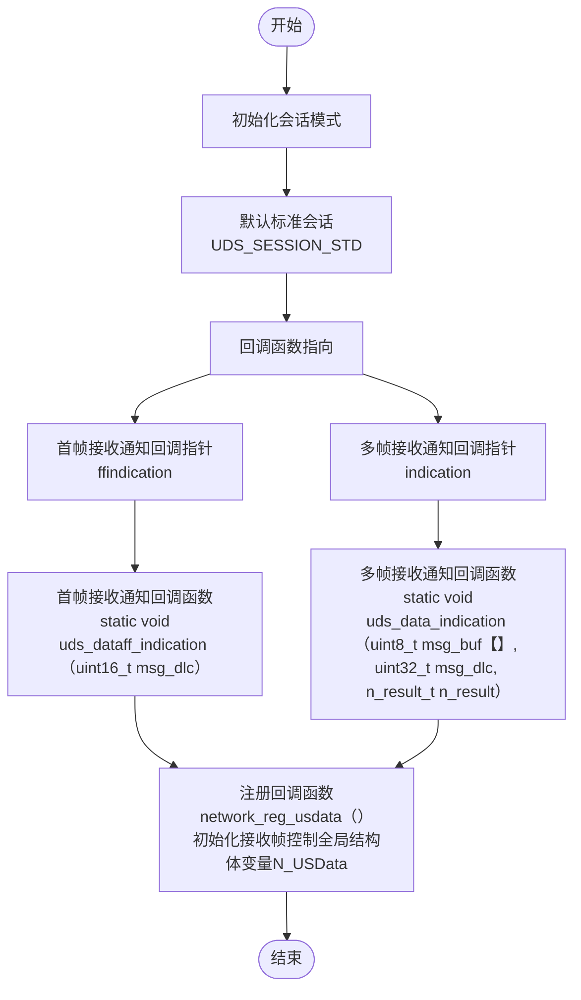
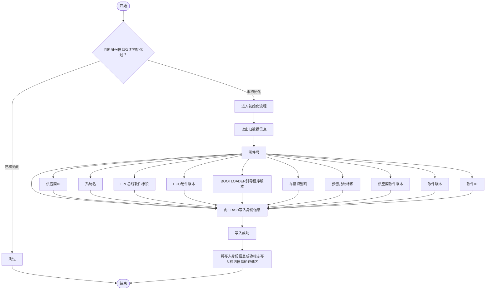
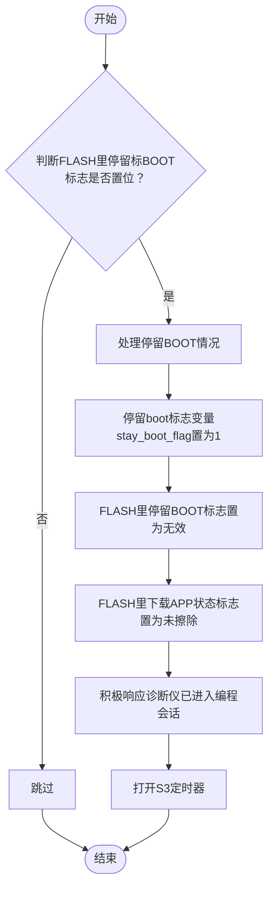
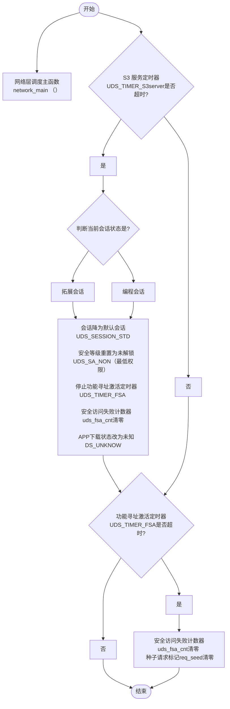
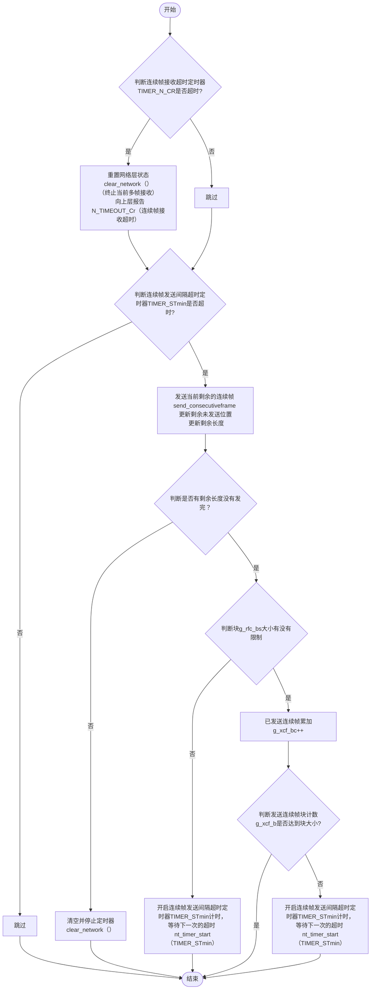
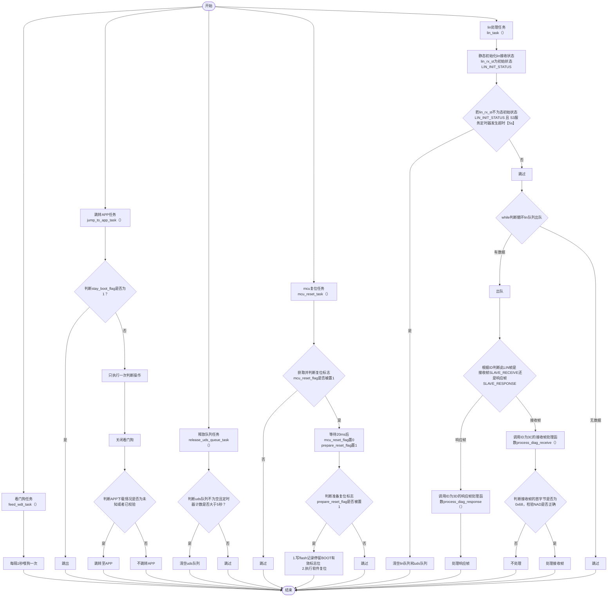
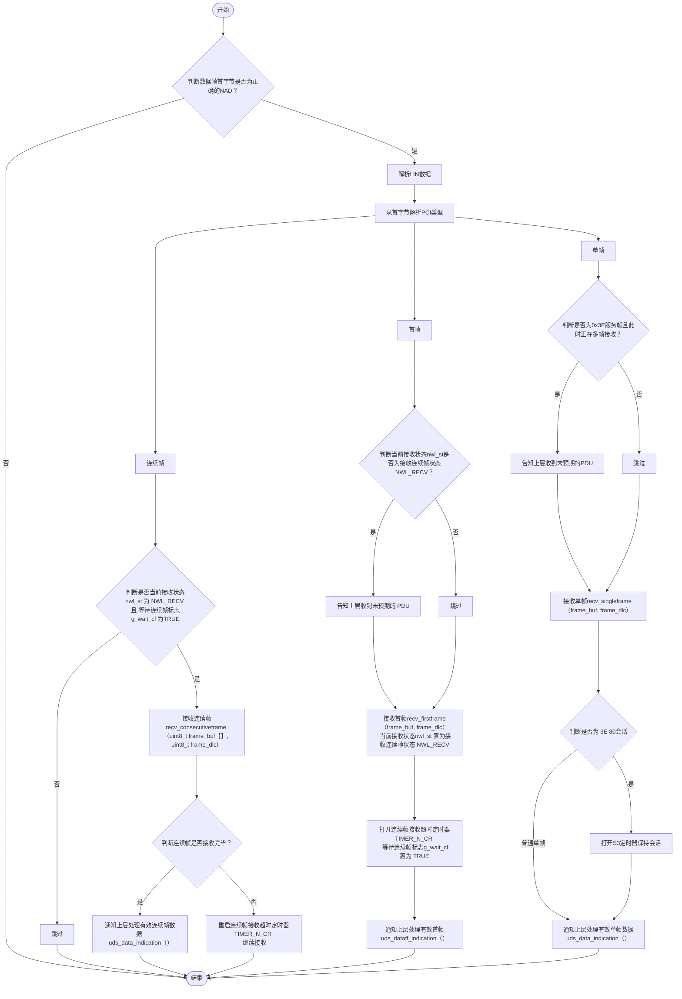
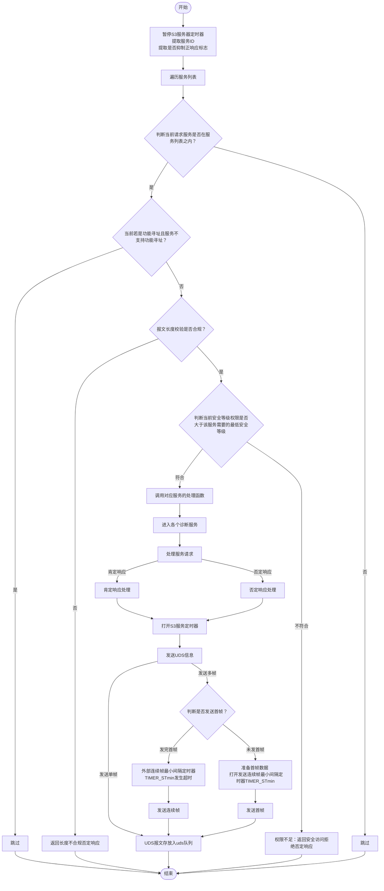
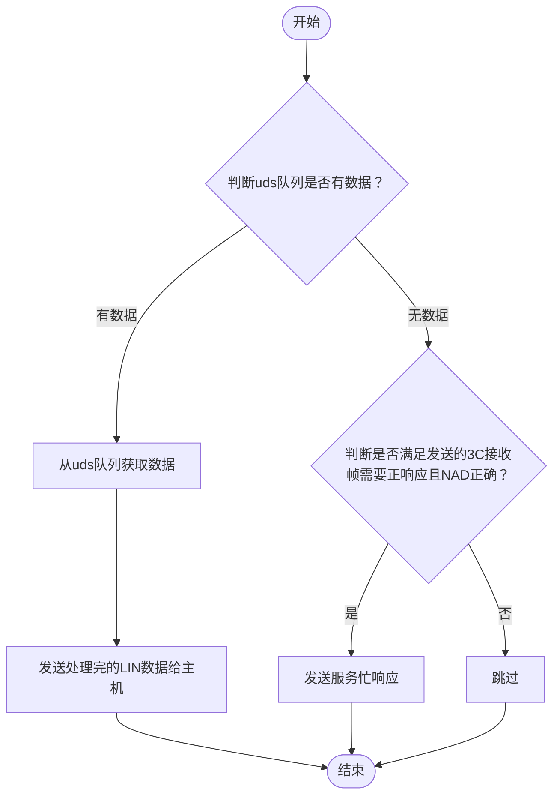

# V32_BOOT_uds_frame
-名称：V32 BOOT部分UDS刷写框架
-版本：0.0.1
-作者：黄俊贤
-时间：2025.11.11

## 1.初始化阶段
#### 1. UDS框架初始化extern int uds_init (void)

- **名称**：uds初始化
- **参数**：void
- **返回值**：0 返回成功 其余失败
- **作用**：用户层uds初始化框架，注册处理接收单帧/首帧/连续帧的回调函数

```c
/**
 * uds_init - uds user layer init
 *
 * @void  :
 *
 * returns:
 *     0 - ok
 */
 //用户层框架初始化
 //处理接收四种帧的回调函数注册
 //初始化初始会话为默认标准会话
 //初始化接收帧控制全局结构体变量N_USData
```



#### 2. 填充身份信息初始化 void fill_identifier_data_init(void)

- **名称**：填充身份信息初始化
- **参数**：void
- **返回值**：：void
- **作用**：把uds各种身份信息填充，写入flash存储

```C
//填充身份信息初始化
/*
防重复：先检查信息是否已存在，存在就不重复初始化；
理数据：把 ECU 的 11 类关键信息（版本、序号、零件号等）整理好，空值填空格，保证格式统一；
存档案：把整理好的信息存到 FLASH 的指定位置，再盖个 “已完成” 的章，方便后续诊断仪用 UDS 服务（比如 0x22 服务）读取这些信息。
```



#### 3. 处理停留在boot的场合 void process_stay_boot_suitation(void)

- **名称**：处理停留在boot的情况
- **参数**：void
- **返回值**：：void
- **作用**：读取FALSH标志位，查看是否在APP把标志位置为停留BOOT，若置位，则进入编程会话进入后面的刷写准备环节。

```C
//处理停留在boot的场合
//当APP接收到10 02服务，停留标BOOT标志STAY_BOOT_STATUS被置位，复位进入boot，便触发进入处理停留BOOT情况
```




## 2.任务调度阶段

### 1ms任务调度

#### 1. uds_main();

- **名称**：uds 运行主函数
- **参数**：void
- **返回值**：：void
- **作用**：用户层uds运行主函数，负责执行S3定时器发生超时，27服务超时，连续帧接收超时处理及连续帧发送间隔时间控制

```c
/**
 * uds_main - uds main loop, should be schedule every 1 ms
 *
 * @void  :
 *
 * returns:
 *     void
 */
```


#### 2. extern void network_main (void)

- **名称**：uds 网络层控制主函数
- **参数**：void
- **返回值**：：void
- **作用**：负责连续帧接收超时处理及连续帧发送间隔控制

```c
/**
 * network_main - network main task, should be schedule every one ms
 *
 * @void
 *
 * returns:
 *     void
 */
//接收端网络层超时处理
//设计为每 1ms 调度一次，负责处理网络层的定时器超时事件和多帧传输的进度管理。
//它是网络层状态机运行的 “心脏”，确保多帧传输按节奏进行，并在超时等异常情况下进行异常处理
```




### while循环任务调度
#### 3.主任务void main_task(void)

- **名称**：mcu主任务调度
- **参数**：void
- **返回值**：void
- **作用**：负责主任务调度，包括：喂狗任务，mcu复位任务，超时释放uds队列任务，LIN帧出队接收和处理任务，刷写完成进入APP任务等。

```c
//主任务调度
//刷写成功校验完成后进入APP任务
//负责将LIN帧数据进行出队接收和处理
//负责MCU的复位任务
//负责喂狗任务
//负责超时释放uds队列任务
```


#### 4.处理接收帧 
#### 1.extern void network_recv_frame (uint8_t func_addr, uint8_t frame_buf[], uint8_t frame_dlc)

- **名称**：处理网络层uds接收帧
- **参数**：
func_addr ：寻址方式
frame_buf ：数据帧缓冲区
frame_dlc ：数据帧长度
- **返回值**：：void
- **作用**：将接收的数据帧进行解析分类处理，对应分成：连续帧，单帧，首帧，进行对应的处理


```C
//网络层通过network_recv_frame函数“接收”底层总线（如 CAN）传来的帧，按 PCI（协议控制信息）帧类型分流处理：
/**
 * network_recv_frame - recieved uds network can frame
 *
 * @func_addr : 0 - physical addr, 1 - functional addr  //寻址类型（0 = 物理寻址，1 = 功能寻址）；
 * @frame_buf : uds can frame data buffer               //接收的帧数据缓冲区（总线传来的原始数据）；
 * @frame_dlc : uds can frame length                    //帧数据长度（DLC，Data Length Code）。
 *
 * returns:
 *     void
 */
```



#### 2.数据请求调用服务列表
#### static void  uds_data_indication (uint8_t msg_buf[], uint32_t msg_dlc, n_result_t n_result)

- **名称**：uds数据请求调用服务列表
- **参数**：
msg_buf ：数据帧缓冲区
msg_dlc ：数据帧长度
n_result：结果信息
- **返回值**：：void
- **作用**：将接收的lin数据解析进行长度，服务列表查询等各种校验，合格的数据最后在服务列表搜寻对应的服务函数地址，进入对应的服务处理


```C
/**
 * uds_data_indication - uds data request indication callback, 
 *
 * @msg_buf  :
 * @msg_dlc  :
 * @n_result :
 *
 * returns:
 *     void
 */
//根据接收过来正确的的多帧[首帧+连续帧]，进行信息校验，最后根据信息位调用对应的服务请求
//UDS（统一诊断服务）模块的核心入口函数——uds_data_indication，它是底层网络（如 CAN/LIN）接收诊断请求后的 “回调处理中心”。
//其核心作用是对收到的诊断报文进行多维度合法性校验，确保只有符合条件的请求才会被分发到对应的 UDS 服务函数（如uds_service_10、uds_service_22）处理
```




#### 5.处理响应帧
- **作用**：等待3D的帧头，将uds队列存放处理好的响应帧数据，进行出队发送给主机响应

```C
//uds队列存放处理完的响应帧，等待主机3D帧头发来即可响应发送LIN数据
//若接收帧需要正响应且NAD正确和队列中无数据，发送忙响应
```

