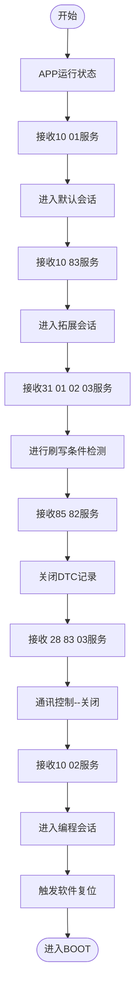
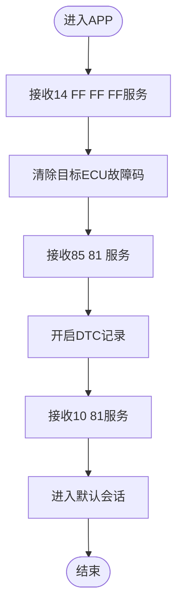

# V32_download_app_process_frame
-名称：V32 刷写APP部分框架
-版本：1.0
-作者：黄俊贤
-时间：2025.12.1

## 1.刷写流程框架

### 1. 初始运行APP阶段

**在APP运行阶段，接收到诊断指令响应**

### 2. BOOT停留刷写阶段

**由APP跳进BOOT，在BOOT阶段接收UDS诊断指令处理**

```mermaid
graph TD
    B([进入BOOT])
    B -->C[接收27 09服务]
    C -->D[进行安全访问请求种子]
    D -->E[ECU回应发送16字节种子数据]
    E -->F[诊断仪接收种子计算密钥<bar/>ECU同时也计算密钥]
    F -->G[接收27 0A服务和16字节密钥数据]
    G -->H[ECU校对密钥,确认密钥成功]
    H -->I[接收2E F1 84服务]
    I -->J[写入指纹信息]
    J -->K[接收34 00服务]
    K -->L[进行请求下载]
    L -->M[进行传输flash driver的hex数据]
    M -->M1[ECU将flash driver的hex数据加载到ROM]
    M1 -->M2[将操作flash函数指针指向此ROM区域的hex数据]
    M2 -->M3[通过函数指针实现在ROM里操作FLASH]
    M3 -->N[接收37服务完成传输信号]

    
    N -->O[接收31 01 DD 02服务]
    O -->P[进行安全签名检查]
    P -->Q[接收31 01 FF 00服务]
    Q -->R[进行FLASH擦除操作]
    R -->S[接收34 00服务]
    S -->T[进行请求下载]
    T -->U[接收36 01服务]
    U -->V[进行APP写入操作]
    V -->X[接收37服务刷写完成信号]
    X -->Y[刷写完成]
    Y -->Y1[接收31 01 DD 02]
    Y1 -->Y2[进行安全签名检查]
    Y2 -->Y3[接收31 01 FF 01]
    Y3 -->Y4[兼容性检测]

    Y4 -->Y5[接收28 80 03服务]

    Y5 -->Y6[通讯控制--开启]
    Y6 -->Y7[接收11 01服务]

    Y7 -->Y8[ECU重启]
    Y8 -->Y9([跳入APP])

```

### 3. 返回运行APP阶段

**APP刷写完成，由BOOT跳进APP，进行刷写后的UDS指令接收**

