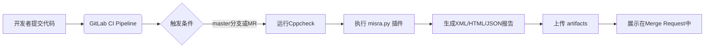

# 软件06-静态检查配置库
**文档编号：SW-STD-06**
**版本：V1.0**
**发布日期：2025-11-11**
**编制人：周工**

---

## 1. 目的

本文档定义了本项目中用于代码质量控制的**静态分析工具链与执行流程**，旨在通过自动化方式识别 C/C++ 源码中的潜在缺陷、编码规范违规及可维护性问题。

由于当前团队未引入商业静态分析工具（如 QAC），本方案采用开源工具 **Cppcheck** 结合自定义插件的方式实现对 MISRA C:2012 规则的部分覆盖，确保在有限资源下仍具备基本的代码合规性保障能力。

---

## 2. 设计原则

| 原则 | 说明 |
|------|------|
| **轻量可行** | 不依赖昂贵许可证，使用成熟开源工具快速落地 |
| **持续集成** | 静态检查嵌入 CI/CD 流程，每次提交自动执行 |
| **可扩展性** | 支持通过 addon/plugin 扩展规则集，未来可迁移至其他平台 |
| **结果可视化** | 输出 XML、HTML 等多种格式报告，便于查看和归档 |

---

## 3. 工具选型与约束条件

### 3.1 当前约束
- 团队尚未部署 QAC、PC-lint Plus 或 Helix QAC 等商业静态分析工具；
- 项目开发预算有限，优先选择免费且社区活跃的开源解决方案；
- 开发环境以 Linux 为主，支持容器化与脚本化部署。

### 3.2 工具选型：Cppcheck + 自定义 Addon
| 工具 | 版本建议 | 功能定位 |
|------|----------|----------|
| **Cppcheck** | ≥2.12 | 主体静态分析引擎，检测内存泄漏、空指针、数组越界等常见缺陷 |
| **MISRA C 插件（misra.py）** | 自研 v1.0 | 实现对 MISRA C:2012 部分规则的检查（基于 Cppcheck Addon 机制） |
| **GitLab CI/CD** | - | 自动化触发静态检查并生成报告 |

> ✅ **优势**：
> - 完全免费，跨平台支持良好；
> - 支持 XML 输出，兼容 GitLab Code Quality 报告标准；
> - 可通过 Python 插件扩展规则，灵活适配项目需求。

> ⚠️ **局限性**：
> - 对 MISRA 的覆盖率低于商业工具（约 60%-70%）；
> - 不支持深层路径敏感分析或形式化验证；
> - 需手动维护插件逻辑，更新成本较高。

---

## 4. 实施流程

### 4.1 总体架构


### 4.2 执行步骤
1. 开发者推送代码至 `master` 分支或发起 Merge Request；
2. GitLab Runner 自动拉取代码并启动 `static_analysis` 阶段；
3. 调用 Makefile 中定义的 `misra` 目标，运行 Cppcheck 并加载 `misra.py` 插件；
4. 生成以下三种格式的报告：
   - `misra-report.xml`：供 CI 系统解析，集成到 MR 页面；
   - `misra-report.html`：人工审查用，带行号高亮；
   - `misra-check.txt`：摘要日志，记录执行状态；
5. 报告作为构建产物（artifacts）保留一周，供追溯查阅。

---

## 5. CI/CD 配置（GitLab CI）

### `.gitlab-ci.yml` 片段
```yaml
# 静态分析阶段
static_analysis:
  stage: static_analysis
  <<: *setup_definition
  script:
    - make -f ./.cimakefile misra
  artifacts:
    reports:
      codequality: report/cppcheck-report.xml
    paths:
      - report/
    expire_in: 1 week
  rules:
    - if: $CI_COMMIT_BRANCH == "master"
    - if: $CI_MERGE_REQUEST_ID
  when: always
```

> **说明**：
> - 使用 `codequality` 类型报告，可在 Merge Request 中直接显示警告数量；
> - 仅在 `master` 分支或 MR 时触发，避免频繁运行影响效率；
> - 报告过期时间为 1 周，节省存储空间。

---

## 6. Makefile 配置

### `.cimakefile` 片段
```makefile
# 目录定义
SOURCES = src/
REPORT_DIR = report
CONFIG_DIR = config
EXIT_ON_ERROR ?= false

# 确保目录存在
$(REPORT_DIR) $(CONFIG_DIR):
	@mkdir -p $@

# MISRA 检查目标
misra: install-misra | $(REPORT_DIR) $(CONFIG_DIR)
	@echo "🔍 Running MISRA C:2012 compliance check..."

	# 检查插件是否存在
	if [ ! -f $(CONFIG_DIR)/misra.py ]; then \
		echo "❌ Error: MISRA plugin not found at $(CONFIG_DIR)/misra.py"; \
		exit 1; \
	fi

	# 执行 Cppcheck 并加载插件
	cppcheck \
		--addon=$(CONFIG_DIR)/misra.py \
		--xml --xml-version=2 \
		--enable=style,performance,portability \
		-I $(SOURCES) \
		$(SOURCES) 2> $(REPORT_DIR)/misra-report.xml

	# 生成文本摘要
	@echo "MISRA C compliance check completed" > $(REPORT_DIR)/misra-check.txt
	@echo "See $(REPORT_DIR)/misra-report.xml for details" >> $(REPORT_DIR)/misra-check.txt

	# 可选：根据结果决定是否失败
	if grep -q "<error" $(REPORT_DIR)/misra-report.xml && [ "$(EXIT_ON_ERROR)" = "true" ]; then \
		echo "⚠️  MISRA check failed with violations. Set EXIT_ON_ERROR=false to allow warnings."; \
		exit 1; \
	else \
		echo "✅ MISRA check completed (warnings allowed)"; \
	fi

# 安装插件（可选）
install-misra:
	@echo "📦 Ensuring MISRA addon is available..."
	@test -f $(CONFIG_DIR)/misra.py || (echo "Please place misra.py in $(CONFIG_DIR)/"; exit 1)
```

> **提示**：
> - 设置 `EXIT_ON_ERROR=true` 可使存在违规时构建失败，适用于发布分支；
> - 使用 `-I` 指定头文件路径，提升包含解析准确性。

---

## 7. Cppcheck Addon 插件说明（misra.py）

### 7.1 插件功能
该 Python 脚本为 Cppcheck 的标准插件格式，实现了对 **MISRA C:2012** 中部分关键规则的检查，包括但不限于：
- Rule 2.1：无用代码（Dead code）
- Rule 8.11：内部链接静态对象必须初始化
- Rule 10.1：不允许进行非常量表达式的位操作
- Rule 17.7：函数调用必须用于获取返回值
- Rule 21.3：禁止使用 `malloc`、`free` 等动态内存函数

### 7.2 插件结构概要
```python
from __future__ import print_function
import cppcheckdata
import sys
import re

# 支持的 MISRA 规则映射表
RULES = {
    'misra-c2012-2.1': 'Avoid dead code',
    'misra-c2012-8.11': 'Static objects shall be initialized',
    # ... 其他规则
}

def process_tokenlist(data):
    """遍历 AST 节点，匹配违规模式"""
    for cfg in data.configurations:
        for token in cfg.tokenlist:
            # 示例：检测 malloc 使用
            if token.str == 'malloc':
                yield {
                    'severity': 'error',
                    'message': 'Use of malloc() is not allowed by MISRA Rule 21.3',
                    'rule': 'misra-c2012-21.3',
                    'line': token.linenr,
                    'file': token.file
                }

# 主入口
if __name__ == '__main__':
    data = cppcheckdata.CppcheckData()
    for violation in process_tokenlist(data):
        sys.stderr.write(f"[MISRA] {violation}\n")
    sys.exit(0)
```

> **注意**：
> - 插件需放置于 `config/misra.py`；
> - 可根据项目需要逐步补充更多规则；
> - 推荐结合 `rules.json` 文件管理规则开关。

---

## 8. 报告输出示例

### 输出文件清单
| 文件 | 格式 | 用途 |
|------|------|------|
| `report/misra-report.xml` | XML | CI 系统解析，集成至 GitLab MR |
| `report/misra-report.html` | HTML | 开发人员本地审查，带语法高亮 |
| `report/misra-check.txt` | TXT | 快速查看执行结果摘要 |

### GitLab MR 显示效果
在 Merge Request 页面将显示类似信息：
```
Code quality has deteriorated (-2 issues)
cppcheck found 2 new problems.
```
点击可跳转至详细报告页面。

---

## 9. 后续演进建议

| 阶段 | 建议动作 |
|------|---------|
| 短期 | 维护现有插件，定期更新 Cppcheck 版本 |
| 中期 | 引入 SonarQube 社区版，增强 UI 与历史趋势分析 |
| 长期 | 若项目升级为 ASIL 级别，评估引入 QAC 或 PC-lint Plus |

---

## 10. 附录：常见问题（FAQ）

**Q1：为什么不用 clang-tidy？**
A：clang-tidy 依赖完整编译数据库（compile_commands.json），在嵌入式交叉编译环境中配置复杂；而 Cppcheck 更轻量，适合快速集成。

**Q2：如何知道哪些 MISRA 规则已被覆盖？**
A：插件内建规则列表，可通过 `--doc` 参数输出支持规则清单，建议建立《MISRA Coverage List》文档同步维护。

**Q3：能否阻止含违规的代码合并？**
A：可以。设置 `EXIT_ON_ERROR=true` 并在 CI 中启用“禁止有 code quality 下降的 MR 合并”策略即可。
