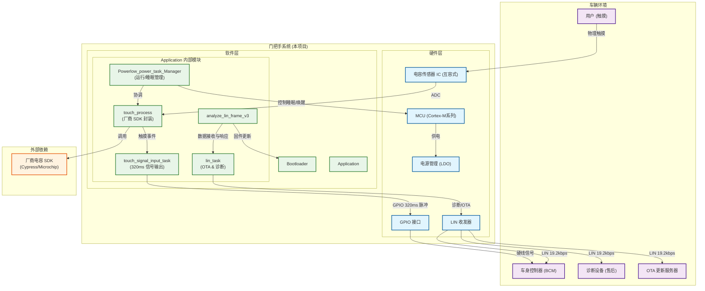

# 门把手触摸功能系统架构图
**文档编号：SYS-ARCH-01**
**版本：V2.0**
**发布日期：2025-12-11**
**编制人：杨**

---

## 1. 概述

本文档描述门把手触摸功能的**系统级架构**，涵盖硬件、软件、通信接口及外部交互关系。架构遵循**功能解耦**与**本地快速响应**原则，确保核心开锁触发功能的可靠性与实时性。

---

## 2. 架构图

---

## 3. 架构说明

### 3.1 硬件架构（HW Layer）
| 组件 | 说明 | 关键接口 |
|------|------|----------|
| **MCU** | 主控制器，运行 Application 与 Bootloader | ADC (传感器)、GPIO (信号输出)、LIN (通信) |
| **电容传感器 IC** | 互容式触摸感应，输出数字状态 | ADC → MCU |
| **GPIO** | 输出 320ms 高电平开锁信号 | → 车身控制器 |
| **LIN 收发器** | 与车身网络通信 | LIN 总线 ↔ 车身控制器/诊断设备 |
| **电源管理** | 12V 转 5V/3.3V，支持低功耗 | 12V 输入，多路稳压输出 |

### 3.2 软件架构（SW Layer）
| 模块 | 职责 | 输入/输出 |
|------|------|----------|
| **Bootloader** | 固件更新与启动管理 | LIN OTA → 新固件；启动 → Application |
| **Cap_Wrapper** | 封装厂商 SDK，获取触摸事件 | 调用 SDK → 触摸状态；中断 ← 传感器 |
| **Signal_Controller** | 控制开锁信号输出时序 | 触摸事件 → GPIO 脉冲；防重复触发 |
| **Power_Manager** | 协调系统与传感器睡眠/唤醒 | 无操作 → 进入睡眠；唤醒源 → 退出睡眠 |
| **LIN_Diag** | 实现诊断服务 | LIN 帧 → 读取/写入 DID；OTA 请求 ← OTA_Handler |
| **OTA_Handler** | 管理固件更新流程 | LIN 数据 → 验证/写入；重启指令 → Bootloader |

### 3.3 外部依赖
- **厂商电容 SDK**：由传感器 IC 供应商提供，负责底层电容算法（滤波、校准、防抖），本项目视为黑盒。
- **车身控制器 (BCM)**：接收 GPIO 开锁信号，执行实际门锁控制；通过 LIN 接收诊断/OTA。

### 3.4 数据流向
1. **主流程**：用户触摸 → 传感器 IC → touch_process→ Signal_Controller → GPIO → BCM → 门锁；
2. **诊断流程**：诊断设备 → LIN → LIN_Diag → 读取内部状态；
3. **OTA 流程**：OTA 服务器 → LIN → LIN_Diag → OTA_Handler → Bootloader → 固件更新。

---

## 4. 关键设计决策

| 决策 | 原因 | 影响 |
|------|------|------|
| **GPIO 输出开锁信号** | 保证本地快速响应（≤100ms），不依赖网络 | 与 BCM 解耦，提升可靠性 |
| **LIN 仅用于诊断/OTA** | 明确职责分离，避免网络延迟影响用户体验 | 简化通信协议，降低复杂度 |
| **厂商 SDK 封装** | 降低底层算法开发风险，利用成熟方案 | 依赖外部库，需管理版本兼容 |
| **低功耗运行** | 满足车载功耗要求（≤200μA 休眠） | 需精确管理睡眠/唤醒状态 |

---

## 5. 依赖关系矩阵

| 模块 | 依赖项 | 依赖类型 |
|------|--------|----------|
| touch_process | 厂商 SDK | 外部库 |
| touch_signal_input_task | touch_process(事件) | 模块间调用 |
| low_power_task | touch_process(无触摸),Lin_Sleep(无数据) | 数据共享 |
| lin_task | low_power_task(唤醒) | 状态通知 |
| lin_task | analyze_lin_frame_v3(有数据) | 事件驱动 |

---

## 6. 接口协议摘要

| 接口 | 协议 | 功能 |
|------|------|------|
| ADC | 标准协议 | 读取传感器原始数据/状态 |
| GPIO | TTL 电平 | 输出 320ms 低电平开锁脉冲 |
| LIN | LIN 2.1 | 诊断 (DID 读取)、OTA (0x34/0x36)、故障与把手开关状态反馈 |
