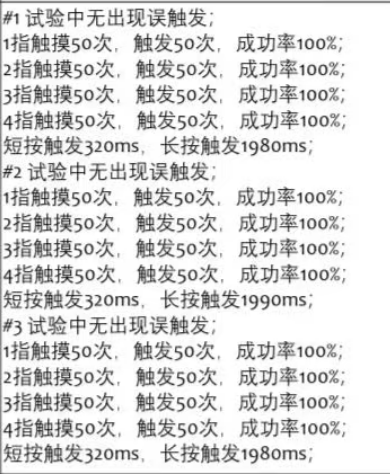
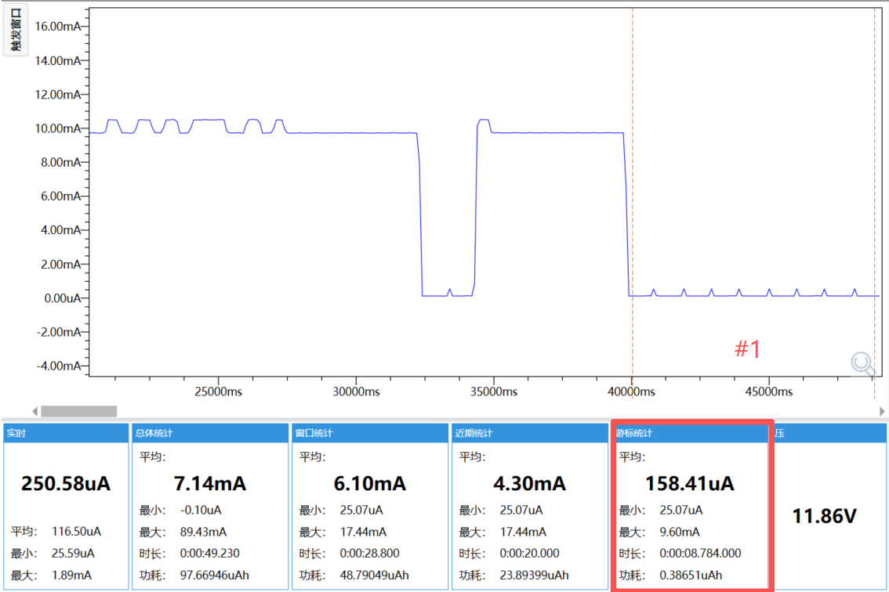
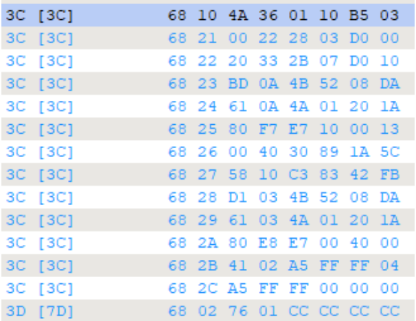
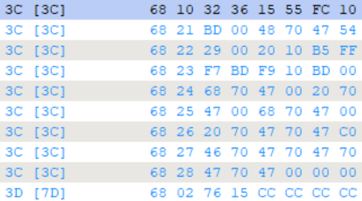
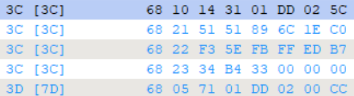
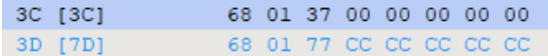

# 软件集成测试报告
## 一、文档概述
### 1.1 编写目的
本报告针对目标软件的分层架构（应用层、业务层、协议层、中间件、驱动层），记录各层级间模块集成测试的过程与结果，验证模块间交互的正确性、稳定性与兼容性，为软件系统的可靠性提供依据，同时为后续系统测试、上线发布提供参考。

### 1.2 测试范围
本次集成测试覆盖软件各层级及跨层级模块的核心交互场景，无功能模块遗漏，具体覆盖范围如下：
- **应用层**：触摸、通信、电源管理模块与业务层对应功能的集成验证
- **业务层**：触摸识别、刷写、低功耗模块与协议层、驱动层的集成验证
- **协议层**：UDS协议模块与中间件算法、业务层功能的集成验证
- **中间件**：SHA256算法、AES算法模块与协议层、驱动层的集成验证
- **驱动层**：电容捕获、GPIO、片内FLASH、LIN、片内EEPROM、看门狗模块与上层模块的集成验证

### 1.3 术语定义
| 术语       | 具体定义                                   |
|------------|--------------------------------------------|
| 集成测试   | 软件测试的核心阶段，验证不同模块间交互逻辑的正确性 |
| UDS协议    | 统一诊断服务协议，车载系统通用诊断交互标准     |
| SHA256/AES | 主流加密算法，用于数据安全传输、存储与校验     |
| 驱动层     | 直接与硬件交互的底层软件，为上层提供硬件操作接口 |
| 低功耗模式 | 软件节能运行模式，需满足系统低电流消耗要求     |

## 二、测试环境

### 1.1 软件环境
测试软件环境与开发环境保持一致，版本无差异，避免环境兼容问题，具体如下：
| 软件名称       | 版本号              | 核心用途                       |
|----------------|-------------------------|--------------------------|
| 集成开发环境   | Keil MDK v5.38/IAR v9.40 | 代码编译、调试与版本管理   |
| 协议分析软件   | CANoe v11.0  /图莫斯      | UDS/LIN协议帧解析与验证   |
| 版本管理工具   | Git                      | 测试版本代码管理           |

## 三、测试用例设计与执行

### 3.1 分层集成测试用例执行结果
本次测试采用**分层渐增式集成**策略，从驱动层到应用层逐层集成验证，共设计7个核心测试用例，覆盖所有集成场景，执行结果如下：

#### 用例1：应用层触摸 ↔ 业务层触摸识别（TC-INT-001）
| 集成场景 | 测试用例ID | 详细测试步骤 | 预期结果 | 实际结果 | 测试状态 |
| --- | --- | --- | --- | --- | --- |
| 应用层触摸 ↔ 业务层触摸识别 | TC-INT-001 | 
1-4指在触摸区域触发50次，单项测试时间>2min， 记录成功次数并记录，同时观察信号输出延迟时间； 短按触发320ms，观察信号输出时间；长按触发2000ms， 观察信号输出时间，采集LIN输出信号值并记录。
 | 
1.单指成功率满足100%，2-4指成功率满足100%。 2.在触发信号时间±20ms。
 | 指灵敏度 满足100%  | 通过 |

**测试截图作证：**

#### 用例2：应用层电源管理 ↔ 业务层低功耗（TC-INT-002）
| 集成场景 | 测试用例ID | 详细测试步骤 | 预期结果 | 实际结果 | 测试状态 |
| --- | --- | --- | --- | --- | --- |
| 应用层电源管理 ↔ 业务层低功耗 | TC-INT-002 | 
1.工作模式下，MCU处于唤醒状态，芯片间隔10ms检测一次触摸信号， 采样脉冲宽度512us，持续工作； 当芯片未检测到触摸信号且时间超过5s后重新进入休眠模式； 2.在通电状态下，无任何动作，等待5s，观察电流值；
 | 
1.在通电模式下，5s后进入休眠模式； 2.电流≤200uA；
 | 符合预期 | 通过 |

**测试截图作证：**

#### 用例3：应用层通信 ↔ 协议层UDS协议（TC-INT-003）
| 集成场景 | 测试用例ID | 详细测试步骤 | 预期结果 | 实际结果 | 测试状态 |
| --- | --- | --- | --- | --- | --- |
| 应用层通信 ↔ 协议层UDS协议 | TC-INT-003 | 
列举应用层发起27服务UDS诊断请求。基于 Boot 下执行： 1.诊断工具发送 27 09/27 0A 解锁后，通过 10 xx 36 xx xx xx 请求。 2.诊断工具发送 27 09/27 0A 解锁后，通过 10 xx 36 8x xx xx 请求
 | 
1.应回复正响应；  2.禁止肯定响应回复正响应；
| 符合预期 | 通过 |

**测试截图作证：**

#### 用例4：业务层APP刷写 ↔ 驱动层片内FLASH（TC-INT-004）
| 集成场景 | 测试用例ID | 详细测试步骤 | 预期结果 | 实际结果 | 测试状态 |
| --- | --- | --- | --- | --- | --- |
| 业务层刷写 ↔ 驱动层片内FLASH | TC-INT-004 | 
业务层发起固件APP刷写请求:部件接收到 36 XX D1 D2 D3 … Dm； 其中,XX 为块序列计数；D1 D2 D3 … Dm 为数据;
 | 
1.刷写正常部件回应 76 XX; 其中，XX 为块序列计数;
 | 符合预期 | 通过 |

**测试截图作证：**

#### 用例5：协议层UDS协议 ↔ 中间件SHA256/AES ↔ 驱动层LIN（TC-INT-005）
| 集成场景 | 测试用例ID | 详细测试步骤 | 预期结果 | 实际结果 | 测试状态 |
| --- | --- | --- | --- | --- | --- |
| 协议层UDS协议 ↔ 中间件SHA256 | TC-INT-005 | 
通过刷写后31服务的完整性校验验证SHA256算法: 部件接收到 31 01 DD 02;
 | 
哈希值计算正确，安全验证一次性通过: 1.部件在150ms内回应成功回应 71 01 DD 02 00; 2.或者150ms内返回NRC78,并在5s内继续返回NRC78 或者返回71 01 DD 02 00;
 | 符合预期 | 通过 |

**测试截图作证：**

#### 用例6：业务层FlashDriver刷写 ↔ 驱动层片内EEPROM（TC-INT-006）
| 集成场景 | 测试用例ID | 详细测试步骤 | 预期结果 | 实际结果 | 测试状态 |
| --- | --- | --- | --- | --- | --- |
| 业务层故障反馈 ↔ 驱动层GPIO | TC-INT-006 | 
业务层发起固件FlashDriver刷写请求:部件接收到 37 C1 C2 C3 C4； 其中，C1 C2 C3 C4 为CRC32校验码，C1为高字节，C4为低字节；
 | 
1.部件在150ms内回应 77 C1 C2 C3 C4； 其中，C1 C2 C3 C4 为CRC32校验码，C1为高字节，C4为低字节； 2.或者150ms内返回NRC78，并在5s内继续返回NRC78 或者返回77 C1 C2 C3 C4；
 | 符合预期 | 通过 |

**测试截图作证：**

### 3.2 测试用例统计
- 总测试用例数：6个
- 通过用例数：6个
- 用例通过率：100%
- 测试执行时长：五天
- 测试人员：郭琼琨

## 四、测试结论
### 4.1 整体测试结论
本次软件集成测试严格按照测试计划执行，覆盖**所有层级、所有核心集成场景**，测试用例通过率100%。

测试结果表明：目标软件各模块间交互逻辑正确、通信稳定、兼容性良好，满足**设计要求与集成测试验收标准**，系统整体可靠性达标，具备进入**系统测试阶段**的条件。

## 五、附录
### 5.1 测试人员信息
| 姓名   | 角色       | 主要职责                     |
|--------|------------|------------------------------|
| 游丽红    | 测试负责人 | 测试计划制定、结果审核       |
| 郭琼琨    | 测试工程师 | 用例执行、缺陷记录、问题定位 |
| 粟嘉明    | 开发工程师 | 缺陷修复、回归测试配合       |

### 5.2 测试时间
- 测试启动时间：2026年4月30日
- 测试结束时间：2026年4月30日
- 回归测试时间：2026年4月30日