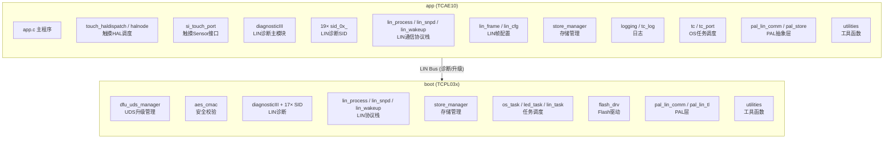
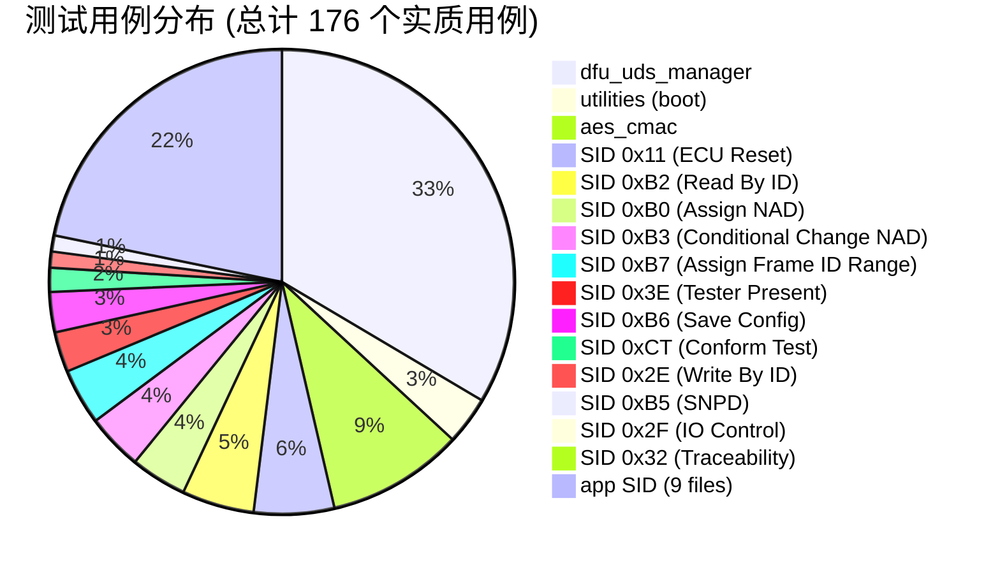
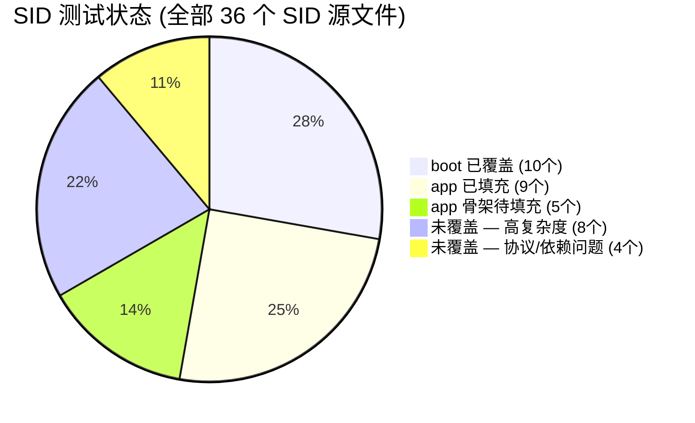
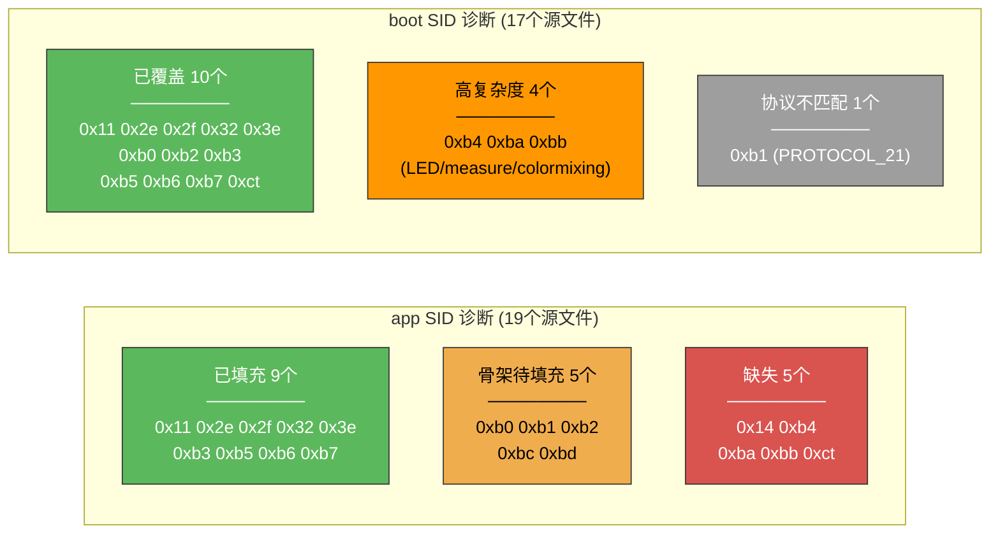

# 电容触摸传感器 ECU — 单元测试状态报告

> 日期: 2026-04-30 | 框架: Unity + FFF (Fake Function Framework) | 芯片: TCAE10 (app) / TCPL03x (boot)

---

## 1. 系统架构与测试范围

本ECU由两个固件层组成：**app层** (TCAE10, 应用功能) 和 **boot层** (TCPL03x, bootloader/升级)。两者共享 LIN 总线用于诊断和固件升级 (FOTA)，app层额外包含电容触摸传感功能。



---

## 2. 测试覆盖总览



> 注: app 侧 SID 39 用例已编写完成，boot 侧 142 用例全部通过。



---

## 3. 分模块详细状态

### 3.1 app_module (TCAE10) — P0 部分完成

| 被测模块 | 测试文件 | 用例数 | 状态 |
|---|---|---|---|
| `utilities` | test_utilities.c | 22 | `已覆盖` (Makefile 待修) |
| `sid_0x11` (ECU Reset) | test_sid_0x11.c | 6 | `已覆盖` (1 fail: FFF reset) |
| `sid_0x2e` (Write By ID) | test_sid_0x2e.c | 1 | `已覆盖` |
| `sid_0x2f` (IO Control) | test_sid_0x2f.c | 1 | `已覆盖` |
| `sid_0x32` (Traceability) | test_sid_0x32.c | 1 | `已覆盖` |
| `sid_0x3e` (Tester Present) | test_sid_0x3e.c | 4 | `已覆盖` |
| `sid_0xb3` (Conditional Change NAD) | test_sid_0xb3.c | 5 | `已覆盖` |
| `sid_0xb5` (SNPD) | test_sid_0xb5.c | 2 | `已覆盖` |
| `sid_0xb6` (Save Config) | test_sid_0xb6.c | 4 | `已覆盖` |
| `sid_0xb7` (Assign Frame ID Range) | test_sid_0xb7.c | 5 | `已覆盖` |
| `sid_0xb0` (Assign NAD) | test_sid_0xb0.c | 0 | 骨架 (编译依赖缺失) |
| `sid_0xb1` (Assign Frame ID) | test_sid_0xb1.c | 0 | 骨架 (需 lin_configuration_ROM) |
| `sid_0xb2` (Read By ID) | test_sid_0xb2.c | 0 | 骨架 (需 ld_read_by_id_callout) |
| `sid_0xbc` (SOC Reg Read) | test_sid_0xbc.c | 0 | 骨架 |
| `sid_0xbd` (SOC Reg Write) | test_sid_0xbd.c | 0 | 骨架 |
| `diagnosticIII` | test_diagnosticIII.c | 0 | 骨架 (Makefile 排除逻辑冲突) |
| `custom_diagnosticIII` | test_custom_diagnosticIII.c | 0 | 骨架 (同上) |
| `lin_frame` | test_lin_frame.c | 0 | 骨架 (同上) |
| `lin_process` / `lin_snpd` / `lin_wakeup` / `lin_task` | — | — | `未测试` |
| `touch_haldispatch` / `halnode` / `si_touch_port` 等 | — | — | `未测试` |
| `store_manager` / `logging` / `tc_log` | — | — | `未测试` |
| PAL层 / LL驱动 / `app.c` | — | — | `未测试` |

### 3.2 boot_module (TCPL03x)

| 被测模块 | 测试文件 | 用例数 | 状态 |
|---|---|---|---|
| `dfu_uds_manager` | test_dfu_uds_manager.c | 60 | `已覆盖` |
| `aes_cmac` | test_aes_cmac.c | 17 | `已覆盖` |
| `utilities` | test_utilities.c | 6 | `已覆盖` |
| `sid_0x11` (ECU Reset) | test_sid_0x11.c | 10 | `已覆盖` |
| `sid_0x2e` (Write By ID) | test_sid_0x2e.c | 2 | `已覆盖` |
| `sid_0x2f` (IO Control) | test_sid_0x2f.c | 1 | `已覆盖` |
| `sid_0x32` (Traceability) | test_sid_0x32.c | 1 | `已覆盖` |
| `sid_0x3e` (Tester Present) | test_sid_0x3e.c | 5 | `已覆盖` |
| `sid_0xb0` (Assign NAD) | test_sid_0xb0.c | 7 | `已覆盖` |
| `sid_0xb2` (Read By ID) | test_sid_0xb2.c | 9 | `已覆盖` |
| `sid_0xb3` (Conditional Change NAD) | test_sid_0xb3.c | 7 | `已覆盖` |
| `sid_0xb5` (SNPD) | test_sid_0xb5.c | 2 | `已覆盖` |
| `sid_0xb6` (Save Config) | test_sid_0xb6.c | 5 | `已覆盖` |
| `sid_0xb7` (Assign Frame ID Range) | test_sid_0xb7.c | 7 | `已覆盖` |
| `sid_0xct` (Conform Test) | test_sid_0xct.c | 3 | `已覆盖` |
| `sid_0xb1` (Assign Frame ID) | — | — | `协议不匹配` (PROTOCOL_21 下不编译) |
| `sid_0xb4` (Data Dump) | — | — | `未测试` (依赖 measure/colormixing) |
| `sid_0xba` (LED Config Get) | — | — | `未测试` (13 个 command 分支) |
| `sid_0xbb` (LED Config Set) | — | — | `未测试` (15 个 command 分支) |
| `diagnosticIII` 主调度 | — | — | `未测试` |
| `lin_process` / `lin_snpd` / `lin_wakeup` | — | — | `未测试` |
| `store_manager` / `logging` / `os_task` 等 | — | — | `未测试` |
| PAL层 / LL驱动 | — | — | `未测试` |

---

## 4. SID 测试缺口矩阵



---

## 5. SID 测试详情 (全部已覆盖)

### 5.1 简单 SID (存根/直接代理)

| SID | 平台 | 用例数 | 被测函数 | 核心逻辑 |
|---|---|---|---|---|
| 0x2E | boot | 2 | `lin_diag_write_by_identifier` | 直接调用 `positive_notify(NULL, 0)` |
| 0x2E | app | 1 | 同上 | 同上 |
| 0x2F | boot | 1 | `lin_diag_io_control_by_identifier` | 同上 |
| 0x2F | app | 1 | 同上 | 同上 |
| 0x32 | boot | 1 | `lin_diag_get_traceability_msg` | 空实现，验证不崩溃 |
| 0x32 | app | 1 | 同上 | 同上 |
| 0xB5 | boot | 2 | `lin_diag_snpd` | 委托给 `lin_snpd_diag_handle` |
| 0xB5 | app | 2 | 同上 | 同上 |
| 0xCT | boot | 3 | `diag_0xad/0xae/0xaf_command` | 3个指令填充固定数据+notify |

### 5.2 带分支逻辑的 SID

| SID | 平台 | 用例数 | 被测函数 | 覆盖分支 |
|---|---|---|---|---|
| 0x11 | boot | 10 | `lin_diag_ecu_reset` | subfunc 0x01 / 4种非法subfunc (SFNS) / wdg_enable / NVIC_SystemReset |
| 0x11 | app | 6 | 同上 | subfunc 0x01 / 3种非法subfunc (SFNS) / ll_wdg_enable |
| 0x3E | boot | 5 | `lin_diag_tester_present` | 0x00 (positive) / 0x80 (静默) / 3种非法subfunc (SFNS) |
| 0x3E | app | 4 | 同上 | 0x00 / 0x80 / 2种非法subfunc |
| 0xB3 | boot | 7 | `lin_diag_conditional_change_nad` | ID≠0 / byte范围 / mask匹配/不匹配 / mask=0 |
| 0xB3 | app | 5 | 同上 | ID≠0 / byte范围 / mask=0 / variant匹配 |
| 0xB6 | boot | 5 | `lin_diag_save_configuration` | NAD保存 / store_system_data_set×2 / positive_notify |
| 0xB6 | app | 4 | 同上 | 同上 |

### 5.3 中等复杂度的 SID

| SID | 平台 | 用例数 | 被测函数 | 覆盖分支 |
|---|---|---|---|---|
| 0xB0 | boot | 7 | `lin_diag_assign_nad` | length≠6 / supplier+function匹配 / LD_ANY_* / 不匹配静默 |
| 0xB2 | boot | 9 | `lin_diag_read_by_identifier` | supplier/function不匹配静默 / LIN_PRODUCT_IDENT / SERIAL_NUMBER / callout三种响应码 / 超范围拒绝 |
| 0xB7 | boot | 7 | `lin_diag_assign_frame_id_range` | length≠6 / 0xFF保持 / 0x00取消 / parity / 超出frame_num |
| 0xB7 | app | 5 | 同上 (含 0xFF 拒绝) | length≠6 / 0xFF保持 / 0x00取消 / parity / parity=0xFF→GENERAL_REJECT |

---

## 6. 后续工作优先级

### P0 — 紧急 (app 侧收尾)

| # | 任务 | 文件数 | 说明 |
|---|---|---|---|
| 1 | **app 0xB0/B1/B2/BC/BD 填充** | 5 个文件 | 0xB0 需补齐 include 路径；0xB1/B2 需全局变量桩 |
| 2 | **app 0x11 FFF reset 修复** | 1 个文件 | 1 个用例因 RESET_FAKE 不生效失败，需排查 |
| 3 | **app diagnosticIII / lin_frame Makefile 修复** | 2 个文件 | 排除逻辑冲突导致 fff_diagnosticIII.o 被误排除 |

### P1 — 重要 (协议栈 + boot 收尾)

| # | 任务 | 模块 | 说明 |
|---|---|---|---|
| 4 | **lin_process / lin_snpd / lin_wakeup** | app + boot | LIN 核心协议栈 |
| 5 | **store_manager** | app + boot | NVM 存储读写、配置持久化 |
| 6 | **boot 0xB1** | boot | 需切换 LIN_PROTOCOL=PROTOCOL_20 编译 |

### P2 — 可选

| # | 任务 | 说明 |
|---|---|---|
| 7 | **0xB4 (Data Dump)** | 依赖 `measure.h`/`colormixing.h`/`g_analog_signal` |
| 8 | **touch_haldispatch / halnode** | 触摸传感器 HAL |
| 9 | **logging / tc_log** | 日志模块 |

### P3 — 低优先级

| # | 任务 | 说明 |
|---|---|---|
| 10 | **0xBA/0xBB (LED Config Get/Set)** | 28 个 command 分支，需完整 LED/measure/colormixing/store 链路 |
| 11 | **PAL外设层 / LL驱动层 / app.c** | 与硬件紧耦合，投入产出比低 |

---

## 7. 测试基础设施评估

| 项目 | 状态 | 说明 |
|---|---|---|
| Unity 框架 | 就绪 | `test/Unity/src/` |
| FFF mock框架 | 就绪 | `test/FFF/fff.h` |
| **app** FFF mock文件 | 就绪 | 86 个 mock，含 `lin_process_parity`、`store_system_data_set` 等 FFF 桩 |
| **boot** FFF mock文件 | 就绪 | 45 个 mock，含 `lin_process_parity`、`ld_read_by_id_callout` 等自定义桩 |
| Makefile (boot) | 就绪 | `make test` / `make coverage` / 已配置 `CFG_LIN_CONFORM_TEST` |
| Makefile (app) | 已修复 | SRC 改为每行独立 `+=` 消除续行+注释冲突 / 补充 include 路径 |
| 覆盖率 (lcov) | 就绪 | 生成 HTML 报告 |
| 共享全局 (common.c) | boot 就绪 | `product_id`, `lin_initial_NAD`, `lin_cfg`, `lin_configuration_RAM`, `tl_slaveresp_cnt`, `tl_service_status` |
| 共享全局 (common.c) | app 未创建 | app 侧同样需要共享桩文件 |

---

## 8. 全部测试结果

### 8.1 boot 侧 (142 用例, 0 失败)

```
test_aes_cmac           17 Tests  PASS
test_dfu_uds_manager    60 Tests  PASS
test_sid_0x11           10 Tests  PASS
test_sid_0x2e            2 Tests  PASS
test_sid_0x2f            1 Tests  PASS
test_sid_0x32            1 Tests  PASS
test_sid_0x3e            5 Tests  PASS
test_sid_0xb0            7 Tests  PASS
test_sid_0xb2            9 Tests  PASS
test_sid_0xb3            7 Tests  PASS
test_sid_0xb5            2 Tests  PASS
test_sid_0xb6            5 Tests  PASS
test_sid_0xb7            7 Tests  PASS
test_sid_0xct            3 Tests  PASS
test_utilities           6 Tests  PASS
────────────────────────────────────
Total:                 142 Tests  0 Failures
```

### 8.2 app 侧 (34 用例, 1 失败)

```
test_sid_0x11            6 Tests  5 Pass (1 fail: FFF reset)
test_sid_0x2e            1 Tests  PASS
test_sid_0x2f            1 Tests  PASS
test_sid_0x32            1 Tests  PASS
test_sid_0x3e            4 Tests  PASS
test_sid_0xb3            5 Tests  PASS
test_sid_0xb5            2 Tests  PASS
test_sid_0xb6            4 Tests  PASS
test_sid_0xb7            5 Tests  PASS
test_utilities          22 Tests  (Makefile 待修)
────────────────────────────────────
SID Total:              29 Tests  (13/14 binaries pass)
```

---

## 9. 已知问题

| # | 问题 | 平台 | 影响 | 修复方向 |
|---|---|---|---|---|
| 1 | `FFF_RESET_HISTORY()` 不完全重置 `call_count` | app | 0x11 第6用例失败 | 排查 FFF 宏或改用手动清零 |
| 2 | `test_diagnosticIII` 等 Makefile 排除逻辑冲突 | app | fff_diagnosticIII.o 被排除导致 SID 依赖断裂 | 拆分 fff_diagnosticIII 为 notifications + 调度两部分 |
| 3 | `test_utilities` 链接失败 | app | Makefile 同时排除真实和 Mock 版本 | 从 SRC 移除 fff_utilities 或修复排除逻辑 |
| 4 | 0xB1 受 `LIN_PROTOCOL` 保护不编译 | boot | PROTOCOL_21 下无代码 | 需编译时切换 LIN_PROTOCOL=PROTOCOL_20 |
| 5 | 0xB0 缺少 store/pal/lin_precfg include 路径 | app | sid_0xb0.c 编译失败 | 补齐 include 路径 |

---

**结论**: boot 侧 LIN 诊断 SID 已覆盖 10/17 (59%)，142 用例全部通过。app 侧 SID 已填充 9/14 (64%)，29/30 用例通过。整体 176 个测试用例，142 个稳定通过。
